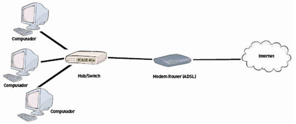

# Neste módulo falamos como o computador se conecta com a internet e como as informações chegam até o nosso dispositivo

## O que é a internet?

A internet é um conjunto de redes de computadores que se comunicam entre si, e que podem ser públicas ou privadas ligando computadores de todo o mundo.

A rede tem como objetivo conectar computadores e fornecer aos usuários acesso a informações e serviços. As internets é feita de cabos que conectam computadores, roteadores, servidores e outros dispositivos do mundo inteiro.

## Rede de computadores e comunicação

A internet pode cair quando a sua rede de computadores não está funcionando corretamente, ou sejam problemas com o seu provedor de internet. A rede de computadores é a conexão entre os computadores e os roteadores, que é o dispositivo que faz a comunicação entre os computadores.

Essa comunicação na internet é feita de protocolos, que são regras que definem como os dados são enviados e recebidos. Os protocolos são divididos em camadas, onde cada camada é responsável por uma parte da comunicação.

<!-- Adiciona imagem Rede.jpg que está na pasta Imagens-->

## IP e MAC Address

IP significa Internet Protocol, que é um endereço de rede que identifica um computador na internet. O IP é dividido em 4 partes, onde cada parte é um número de 0 a 255, e é separado por um ponto.

Mac Address é um endereço físico que identifica um dispositivo na rede. O Mac Address é dividido em 6 partes, onde cada parte é um número hexadecimal, e é separado por dois pontos.

É atraves do IP que o seu computador se comunica com outros computadores na internet enviando e recebendo dados. O IP é um endereço lógico, que pode mudar de acordo com o seu provedor de internet, já o Mac Address é um endereço físico, que não muda.

## Servidores

É um computador que fornece serviços para outros computadores na rede. Os servidores são responsáveis por armazenar informações, como arquivos, e fornecer acesso a essas informações para os outros computadores.

Equipado com um ou mais processadores, memória RAM, disco rígido e placa de rede, e algum sistema para armazenar os dados. Os servidores são usados para hospedar sites, armazenar arquivos, enviar e-mails, entre outros serviços.

## DNS

Domain Name System é um sistema de nomes de domínio que converte nomes de domínio em endereços IP. O DNS é usado para acessar sites na internet, pois é mais fácil de lembrar um nome de domínio do que um endereço IP.

## HTTP

Hypertext Transfer Protocol é um protocolo de comunicação que é usado para transferir dados na internet. O HTTP é usado para acessar sites na internet, pois é o protocolo que define como os dados são enviados e recebidos.

O HTTPS é uma versão segura do HTTP, que é usado para acessar sites que precisam de segurança, como sites bancários através de um certificado digital e criptografia.
