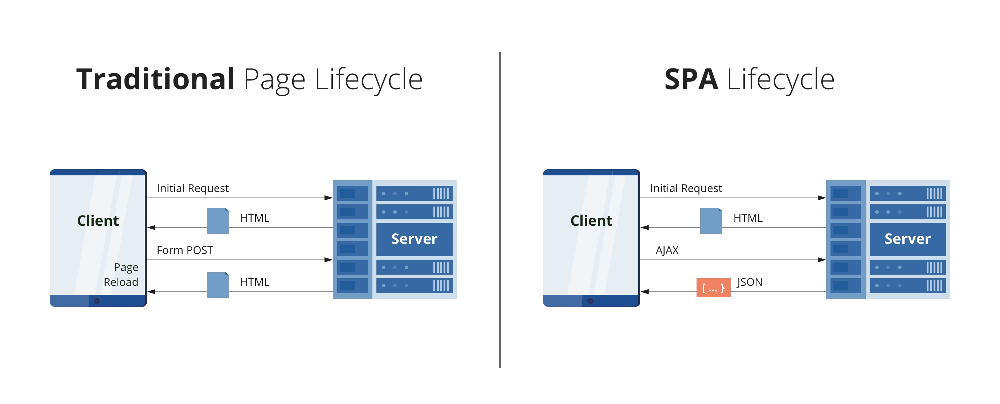

# Neste tópico será falado sobre os tipos de aplicações web e os seus conceitos

## O que é webpage?

Webpage são páginas web acessado através pelo navegador, encotnrado pelo seu URL (Uniform Resource Locator), que é o endereço da página web. Por exemplo, o URL do Google é https://www.google.com/. A resposta dada pelo servidor é uma cópia da página HTML, CSS e JavaScript.

- O HTML é a linguagem de marcação, que é usada para criar a estrutura da página web;
- O CSS é a linguagem de estilo, que é usada para estilizar a página web;
- O JavaScript é a linguagem de programação, que é usada para criar interações na página web.

## Website estático e dinâmico

Website é um agrupamento estruturado de várias páginas WEB, que podem ser acessadas através de um URL.

Website estático é um website que não possui interações, ou seja, não possui formulários, não possui banco de dados, não possui login, não possui cadastro, não possui atualização de dados, não possui nada que mude a página web.

Já o website dinâmico é um website que possui interações, podendo a página ser diferente para cada usuário, podendo ter formulários, banco de dados, login, cadastro, atualização de dados, etc.

    
    

## O que é uma aplicação web?

É um programa, um software que vive no servidor, porém ele possui banco de dados, lingua de programação, etc. Ele é acessado através de um URL, porém ele é diferente de um website, pois ele possui interações, formulários, banco de dados, login, cadastro, atualização de dados, etc.
Exemplo: Facebook, Gmail, Youtube, Figma, etc.

Eles são caracterizados por ser responsivos, ou seja, se adaptam a qualquer dispositivo, seja ele um celular, um tablet, um computador. A performance deles é muito boa, pois eles são desenvolvidos por grandes empresas, que possuem muitos recursos para desenvolverem esses softwares e a acessibilidade visual, auditiva e SEO (Search Engine Optimization) é muito boa.

## O que é front-end e back-end?

O front-end é uma parte da aplicação web, que é responsável por mostrar a interface para o usuário, ou seja, é a parte visual da aplicação web. O back-end é uma parte da aplicação web, que é responsável por fazer a lógica da aplicação web, ou seja, é a parte não visual da aplicação web.

Quando nós usuários acessamos uma aplicação web, nós acessamos o front-end, pois é a parte visual da aplicação web. Porém, quando nós usuários fazemos login, cadastro, atualização de dados, etc, nós acessamos o back-end, que nos retorna uma resposta, que é mostrada no front-end.

## Tecnologias front-end

- HTML
- CSS
- JavaScript e imagens
- Frameworks e Bibliotecas

## Tecnologias back-end

- Linguagem de programação
- Banco de dados
- Regras de negócio da aplicação

## Aplicação web tradicional vs SPA

A tradicional ela precisa recarregar a página para ter o seu conteúdo atualizado, o front-end e o back-end numa só aplicação e o servidor processa e devolve toda a página de uma só vez.

Enquanto o SPA ele não precisa recarregar a página para ter o seu conteúdo atualizado, o front-end e o back-end são separados, o servidor processa e devolve apenas o conteúdo que foi atualizado. Dando uma sensação de que as páginas é tudo uma só.

O Front-end feito com uso de frameworks e o back-end no formato de API.

